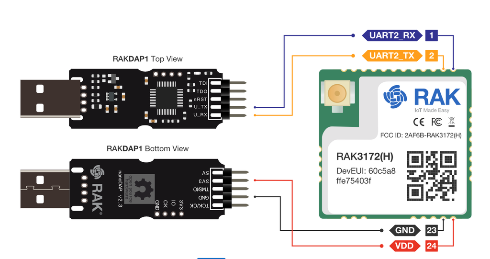
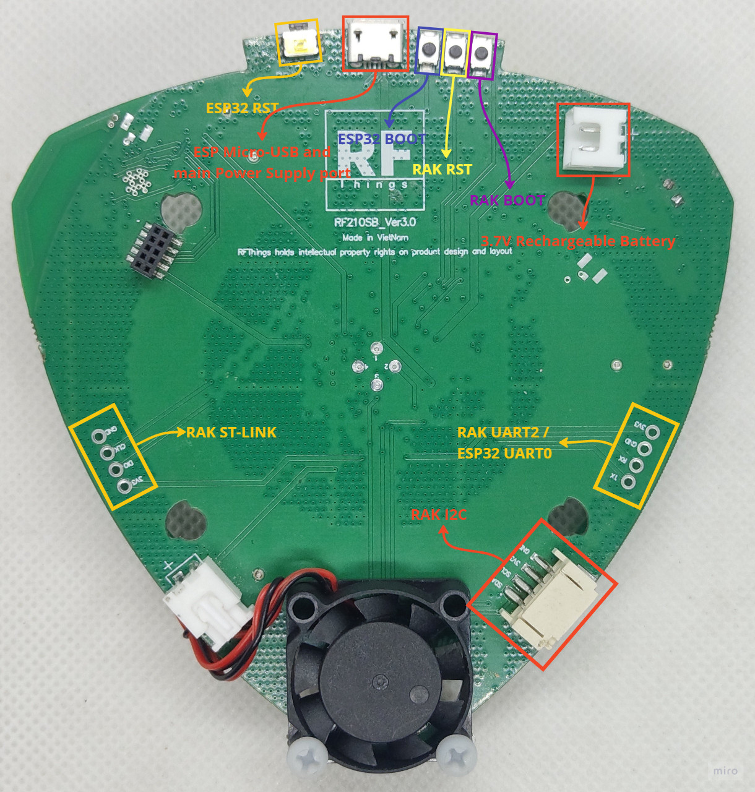
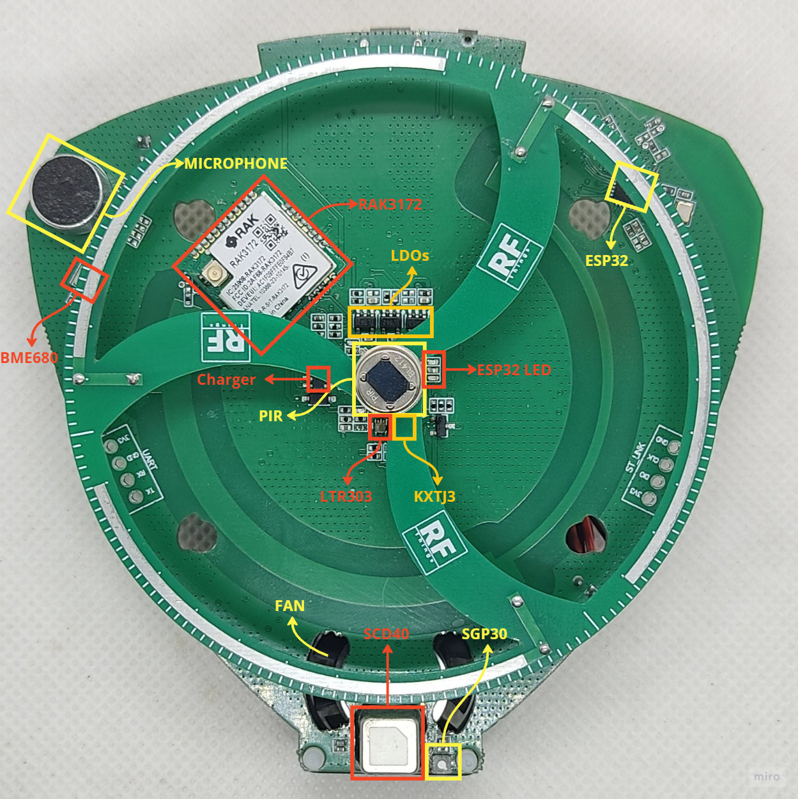
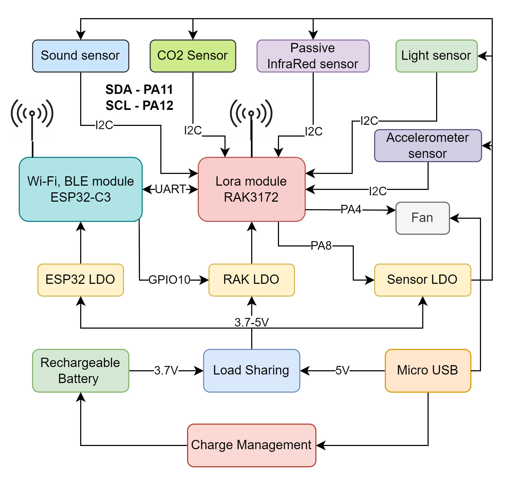
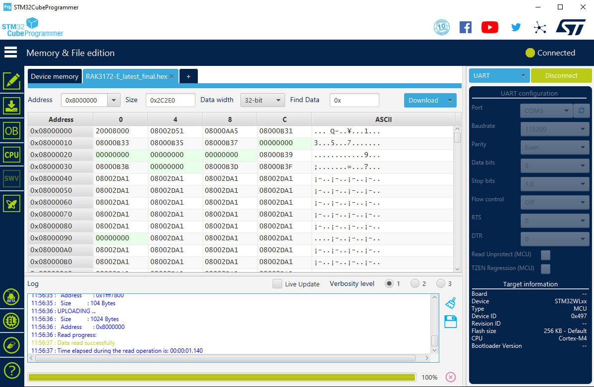
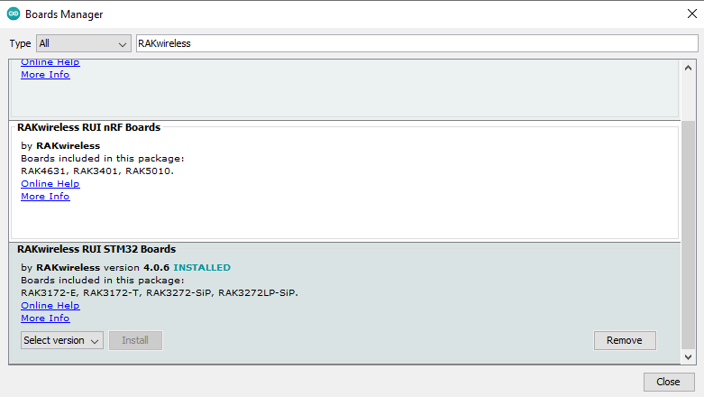
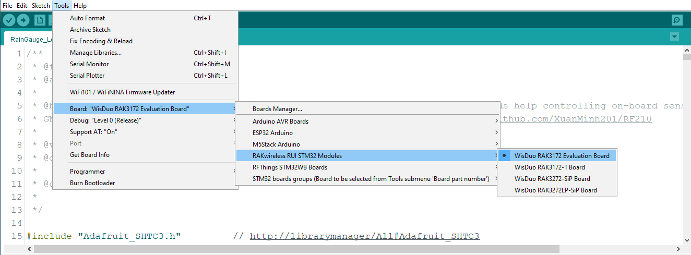

# RF210 SB

### Additional Information
RF210_SB firmware ATC
version 1.2

Supported sensors:
- [Carbon Dioxide Sensor - SCD40](https://github.com/Sensirion/arduino-i2c-scd4x)
- [Environmental Sensor - BME680 (**optional**)](https://github.com/Zanduino/BME680/tree/master)
- [Air Quality Sensor - SGP30 (**optional**)](https://github.com/adafruit/Adafruit_SGP30)
- [Tri-Axis Accelerometer - KXTJ3](https://github.com/ldab/KXTJ3-1057)
- [Ambient Light Sensor - LTR303](https://github.com/adafruit/Adafruit_LTR329_LTR303)
- [High Sensitivity Digital PIR Module - SB412](https://www.senbasensor.com/pir-sensor-module/sb412.html)
- [Sound Sensor](https://www.analog.com/media/en/technical-documentation/data-sheets/MAX9814.pdf)


Command general format: ```ATC+<cmd>=?```

- ```ATC+VER=?```: Return the firmware version.
- ```ATC+SCD4x=?```: Return all values from the SCD41 sensor including temperature, humidity, and CO2. 
- ```ATC+SCDCO2=?```: Return the CO2 value from the SCD41 sensor. 
- ```ATC+SCDTEMP=?```: Return the temperature value with 0.01°C resolution from the SCD41 sensor. 
- ```ATC+SCDHUM=?```: Return the humidity value with 1% resolution from the SCD41 sensor. 
- ```ATC+BME680=?```: Return temperature, humidity, pressure, and gas resistance values from the BME680 sensor
- ```ATC+SGP30=?```: Return TVOC, eCO2, rawH2, and rawEthanol values from the SGP30 sensor. 
- ```ATC+KXTJ3=?```: Return the status of the KXTJ3 sensor including x, y, and z acceleration values. 
- ```ATC+LTR=?```: Return the status of the LTR-303 sensor including visible_plus_ir and infrared values. 
- ```ATC+SOUND=?```: Return a sound recording. 
- ```ATC+PIR=?```: Return 0 or 1 indicating if motion is detected (0: No motion, 1: Motion detected). 
- ```ATC+SEND=?```: Send a LoRaWAN packet with sensors data. 
- ```ATC+BAT=?```: Return battery voltage in mV.
- ```ATC+POWER=?```: Return power status. 
- ```ATC+FAN=[status]```: Set fan status (`0` for off, `1` for on).

 
## Getting Started

### Hardware

- USB to UART Converter
- RFThings RF210_SB Board

### Sortware

- Arduino IDE (version v1.8.13 or above is recommended)
- RUI3 lastest firmware for RAK3172: [RAK3172-E_latest_final.hex](https://downloads.rakwireless.com/RUI/RUI3/Image/RAK3172-E_latest_final.hex)
- (STM32CubeProgammer)[https://www.st.com/en/development-tools/stm32cubeprog.html]
  
### Additional Libraries

- SensirionI2CScd4x.h
- Zanshin_BME680.h
- Wire.h
- kxtj3-1057.h
- Adafruit_LTR329_LTR303.h
- Adafruit_SGP30.h
  
## Hardware connection
<p style="text-align: center;">
  
</p>

### Ports on the RF210SB board:

<p style="text-align: center;">
  
</p>

### Components on the RF210SB board:

<p style="text-align: center;">
  
</p>

### Block diagram:

<p style="text-align: center;">
  
</p>

### In STM32CubeProgammer:
  -  Hold the **B_RAK (boot)** button and press **R_RAK (reset)** button and release the **B_RAK (boot)** button to enter bootmode.
  -  Select UART, Baudrate 115200 and press Connect.
  -  Open RAK3172-E_latest_final.hex
  -  Select the address as in following image if needed
  -  Press Download to upload firmwave
  -  After download success, press **R_RAK (reset)** button to exit the bootmode
  
<!--  -->

 

### In Arduino IDE:
  -  Add this JSON in Additional Boards Manager URLs [\(Show me how?\)](https://support.arduino.cc/hc/en-us/articles/360016466340-Add-third-party-platforms-to-the-Boards-Manager-in-Arduino-IDE):

```  
https://raw.githubusercontent.com/RAKWireless/RAKwireless-Arduino-BSP-Index/main/package_rakwireless.com_rui_index.json
```

  -  Go to **Tool -> Board -> Boards Manager**, search & install **RAKwireless RUI STM32 Boards**
  -  Open ```ATC_Command_SB_1_2.ino``` sketch, select **WisDuo RAK3172 Evaluation Board** from **Tool** menu
  -  Plug in your board and upload

<p style="text-align: center;">
  
</p>

  -  Select **Tool -> Board -> RAKwireless RUI STM32 Modules -> WisDuo RAK3172 Evaluation Board**

<p style="text-align: center;">    
  
</p>
